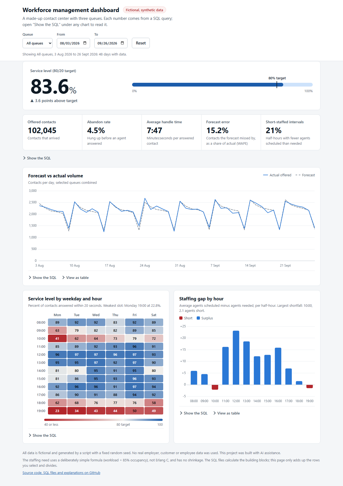
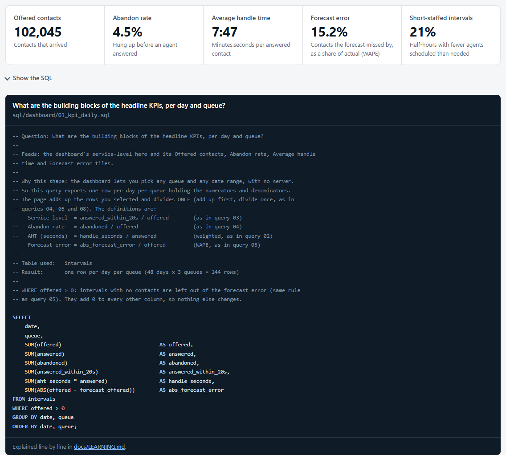
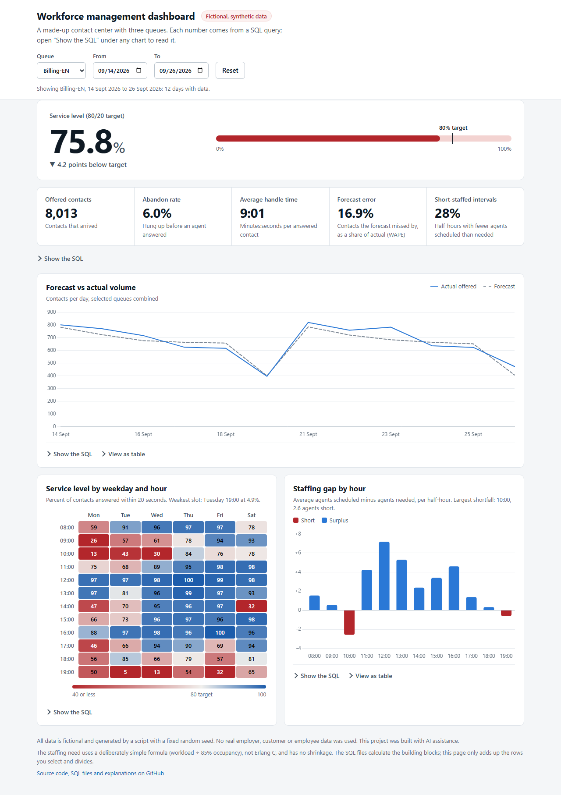
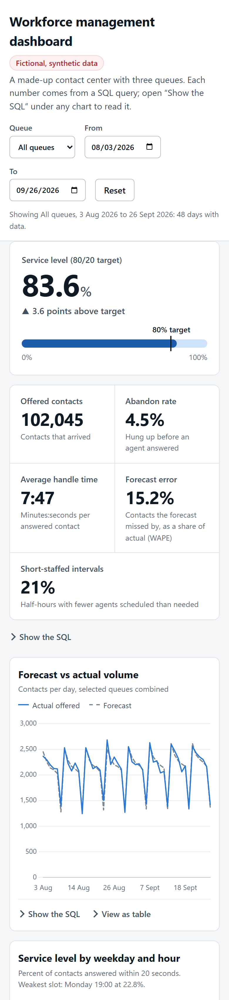

# WFM SQL Dashboard

A workforce-management (WFM) dashboard for a **fictional** contact center. Every metric (service level, abandon rate, forecast accuracy, staffing gap, adherence) is calculated by a plain SQL query in [`/sql`](sql/), and the dashboard shows the exact query next to each chart.



> **Honesty notes**
> - **All data is synthetic.** It is produced by [`scripts/generate_data.py`](scripts/generate_data.py) with a fixed
>   random seed. No real employer, customer, or employee data was used. Agent IDs like `AGT-001` are made up.
> - **This project was built with AI assistance** (Claude Code). The author is a Workforce Management Analyst who
>   specified the domain, set the working rules, reviewed each step, and is learning SQL through it; the AI wrote most
>   of the code.
> - Some things are deliberately simplified, see [Simplifications and next steps](#simplifications-and-next-steps).

## What it is

- 3 queues: `Support-EN`, `Support-DE`, `Billing-EN`
- 8 weeks of data, 30-minute intervals, Monday to Saturday, 08:00 to 20:00 (3,456 interval rows, 69 agents)
- SQLite database in a single file: [`data/wfm.db`](data/) (committed, so the repo works right after cloning)
- 8 SQL questions (easiest first), a static dashboard, and a "Show the SQL" panel next to every chart

## What this demonstrates

- **SQL, one skill at a time:** aggregation and `GROUP BY` (queries 1, 2, 4), calculated columns and `CASE` (3), `NULL` handling (3, 6), error metrics (5), `WITH` steps and the `LAG` window function (6, 7), `JOIN` and `UNION ALL` (8). Each is explained line by line for a beginner in [docs/LEARNING.md](docs/LEARNING.md).
- **WFM judgement written into the queries:** weighted AHT, service level measured against *offered* contacts, "add up first, divide once" for rates, MAPE vs WAPE vs bias, and a staffing gap that shows when the schedule is thin instead of hiding it in a daily average.
- **Honest engineering:** seeded synthetic data, every query result re-checked by an independent Python calculation ([`scripts/verify_queries.py`](scripts/verify_queries.py), 14 checks), and every simplification written down.
- **A deployable static site with no backend:** the SQL runs at build time, the results are exported as JSON, and the page only filters and draws.

## The dashboard

A static web page in [`dashboard/`](dashboard/): a service-level hero with its target meter, five more KPI tiles, a forecast vs actual chart, a service-level heatmap (weekday × hour), a staffing-gap chart, filters for queue and date range, table views, and a **"Show the SQL"** panel under every chart that displays the exact query behind it.

| Show the SQL under any chart | A filtered view (Billing-EN, last two weeks) |
|---|---|
|  |  |

It works on a phone too:



```bash
python scripts/export_dashboard.py                        # run the SQL, write dashboard/data/*.json
python -m http.server 8000 --directory dashboard          # then open http://localhost:8000
```

(Open it through the small web server above; double-clicking `index.html` cannot load the data files.)

```
data/wfm.db -> sql/dashboard/*.sql -> scripts/export_dashboard.py -> dashboard/data/*.json -> the page
              (all the logic)        (runs the SQL, no logic)        (committed to git)       (draws it)
```

**One deliberate compromise.** To let you pick any queue and date range without a server, the SQL exports *building blocks* (contacts offered, answered within 20 s, abandons, handle seconds ... per day or per hour). The browser adds up the rows you selected and divides once. Every metric definition lives in the SQL files; the JavaScript never defines a metric. [`scripts/verify_queries.py`](scripts/verify_queries.py) checks the exported numbers against the standalone queries (for example 102,045 contacts and 83.6% service level for the full period).

## Try it

Needs Python 3 (no extra packages).

```bash
python scripts/generate_data.py   # rebuilds data/wfm.db (same result every time)
python scripts/check_data.py      # prints row counts and sample rows
python scripts/run_sql.py         # lists the queries; add a file name to run one
python scripts/verify_queries.py  # re-check every result with plain Python
```

| Query | Question it answers |
|---|---|
| [`01_offered_per_day_queue`](sql/01_offered_per_day_queue.sql) | Contacts offered per day, per queue |
| [`02_aht_per_queue`](sql/02_aht_per_queue.sql) | Average handle time per queue (weighted by contacts) |
| [`03_service_level_per_interval`](sql/03_service_level_per_interval.sql) | Service level per interval vs the 80/20 target |
| [`04_abandon_rate_weekly`](sql/04_abandon_rate_weekly.sql) | Abandon rate per queue per week |
| [`05_forecast_accuracy`](sql/05_forecast_accuracy.sql) | Forecast vs actual: MAPE, WAPE and bias per queue |
| [`06_wow_volume_change`](sql/06_wow_volume_change.sql) | Week-over-week volume change (window function `LAG`) |
| [`07_staffing_gap`](sql/07_staffing_gap.sql) | Agents needed vs scheduled per interval (simple formula, not Erlang C) |
| [`08_adherence_team_agent`](sql/08_adherence_team_agent.sql) | Schedule adherence per team and per agent |

## How it was built

Built in five small milestones (data, queries 1-4, queries 5-8, dashboard, polish) with an AI assistant, following the rules in [`CLAUDE.md`](CLAUDE.md): plan first and wait for approval, explain every query in plain language, keep all metric logic in `.sql` files, use fictional data only, and be honest about simplifications. Notes on the process and how to talk about it are in [docs/INTERVIEW.md](docs/INTERVIEW.md).

## Project layout

| Path | What |
|---|---|
| `sql/` | One `.sql` file per business question (`sql/dashboard/` feeds the dashboard) |
| `dashboard/` | The static dashboard (HTML, CSS, JS, exported JSON; Chart.js 4.4.7 vendored in `dashboard/vendor/`) |
| `data/schema.sql` | Table definitions |
| `data/wfm.db` | The SQLite database |
| `scripts/` | Data generator, query runner (`run_sql.py`), query checker (`verify_queries.py`), dashboard export (`export_dashboard.py`) |
| `docs/DATA.md` | What each column means and how the fake data is shaped |
| `docs/LEARNING.md` | Plain-language SQL explanations |
| `docs/INTERVIEW.md` | Talking points, likely questions and honest limits |
| `CLAUDE.md` | The working rules for the AI assistant |

## Simplifications and next steps

- Data is generated from simple formulas (daily and time-of-day curves, noise, a few injected spikes), not from a real contact center. Service level comes from a smooth S-curve of agent load, not from a queue simulation. See [docs/DATA.md](docs/DATA.md).
- The staffing need is *workload ÷ 85% occupancy*, using actual contacts, with no shrinkage. It is also partly circular: the data generator's planner used the same idea. The industry-standard method is **Erlang C**, which adds queueing and the service-level target; it is the natural next step.
- Abandons include very short ones, because the data has no wait times.
- The dashboard has a light theme only.
- Natural extensions: Erlang C staffing, shrinkage, intraday re-forecasting, multi-skill agents, real wait-time data.

## License

[MIT](LICENSE)
